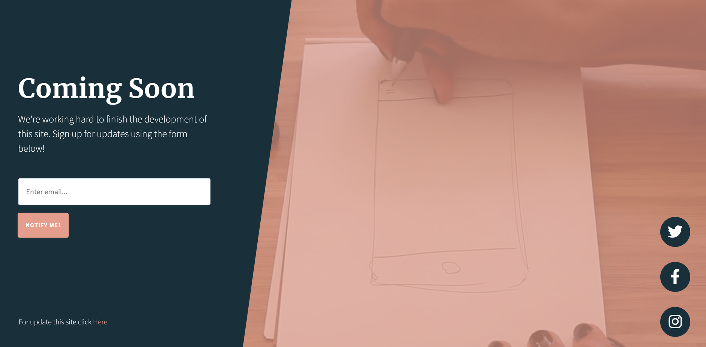
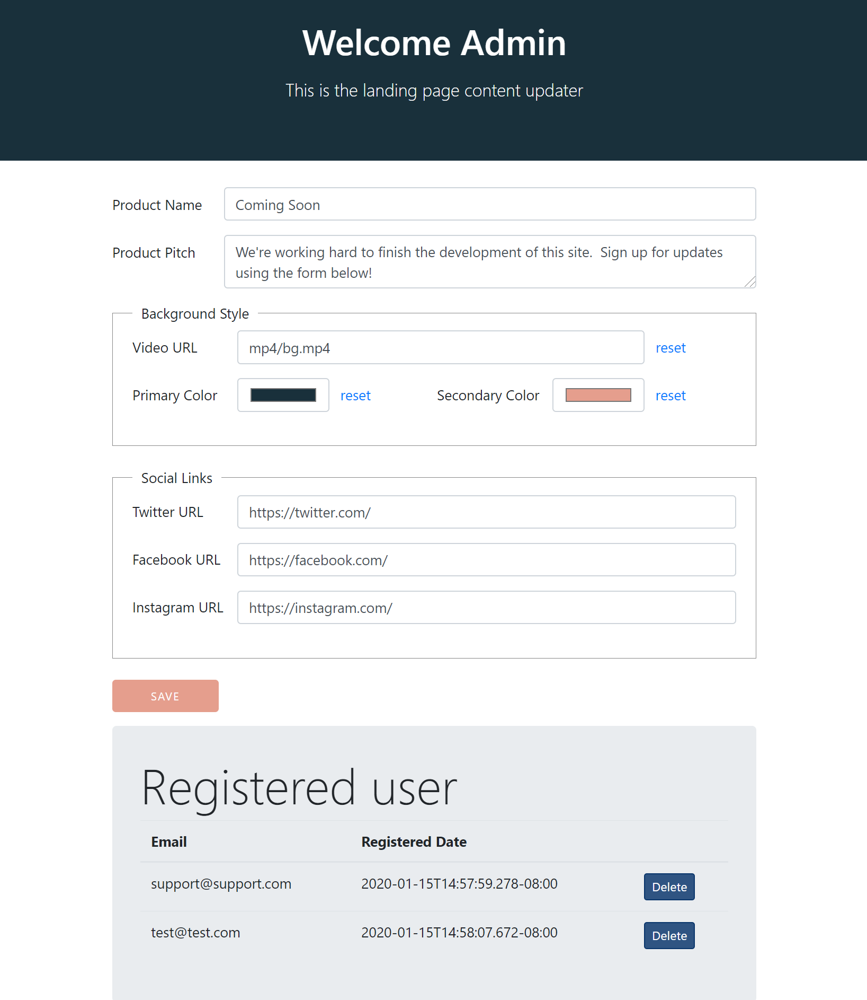

# Simple Landing Page

Basic boilerplate for creating an app landing page. Visit /admin to manage the emails collected.
This project implemented with Reshuffle, Handlebars, REST API, gulp and bootstrap.

## Screenshot

### Home Page

<p>



### Admin Page



</p>

## Running locally

To run your express server locally run:

```bash
npm install
npm start
```

## Running remotely

Deploy your app to the Reshuffle cloud to run it remotely. Simply run:

```bash
npx reshuffle deploy
```

from the projects root directory
